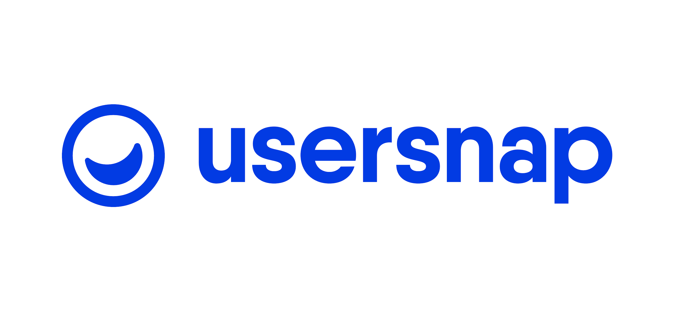

# Usersnap Public repository

This repository list examples for installing widgets in different popular frameworks.

Current examples:
 - gatsby
 - next-js
 - nuxt-js
 - react-js
 - pwa
 - vue-js
 
 If you are having issues or a request for another framework, check our [help center](https://help.usersnap.com/).

Obtain your free 15 day trial account at [Usersnap.com](https://usersnap.com).
