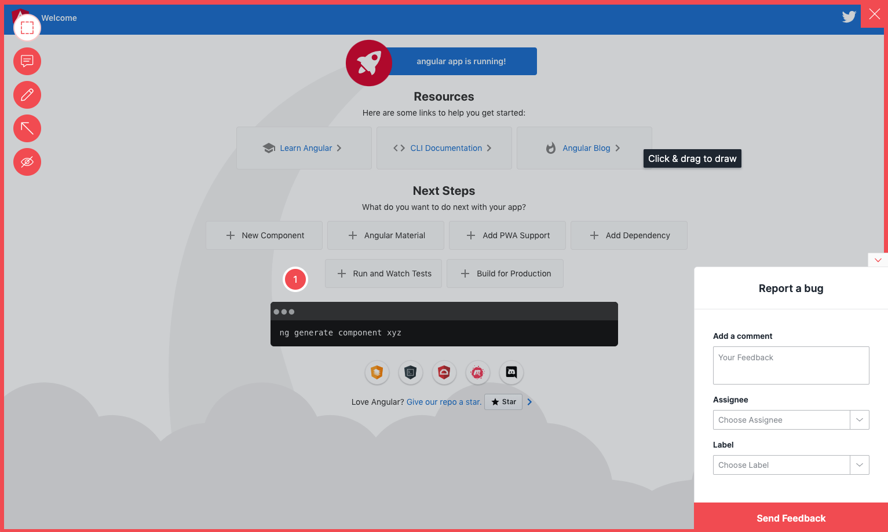

# Add Usersnap to Angular

This example showcases how to add Usersnap Platform widgets to Angular. The project is an standard Angular project created with `ng new angular`.

## Starting up the example
```bash
    npm install
    ng serve
```

The site should be up and running on `http://localhost:4200/`.



## Show me how it's done

The component to handle the widget uses a Angular workaround to be able to inject scripts from a component. Check `src/app/usersnap/` for details. The usersnap component can then be used as seen in `src/app/app.component.html`

Make sure to update global api key and project api key values.

If it doesn't work, post on [GitHub discussions](https://github.com/usersnap/public/issues).

If you need help on how to use the api, see our [documentation](https://help.usersnap.com/docs/flexible-use-cases-for-global-snippet).