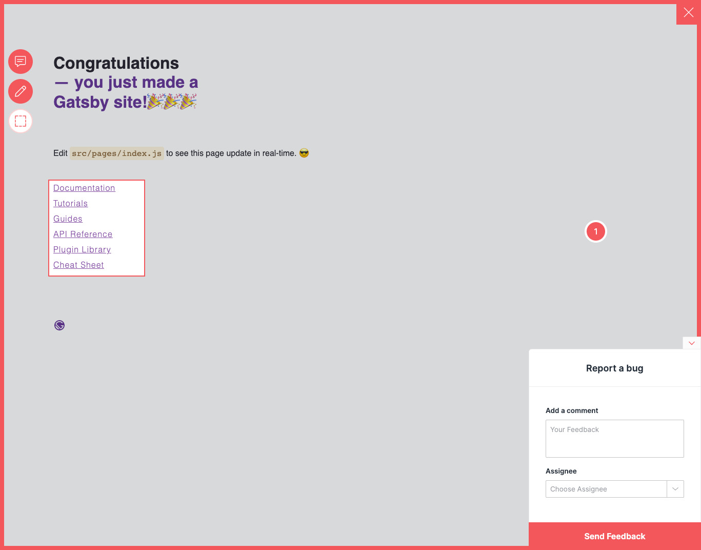

# Add Usersnap to Gastby

This example showcases how to add Usersnap Platform widgets to Gatsby.
 It is based on the Gatsby `minimal starter`

## Starting up the example

```bash
yarn install
yarn dev
```
The site should be up and running on [http://localhost:8000](http://localhost:8000)! 



## Show me how it's done
The implementation uses `gatsby-plugin-react-helmet` and can be viewed in `src/pages/index.js`. 

Make sure to update global api key and project api key values.
 
If it doesn't work, post on [GitHub discussions](https://github.com/usersnap/public/issues).

If you need help on how to use the api, see our [documentation](https://help.usersnap.com/docs/flexible-use-cases-for-global-snippet).
