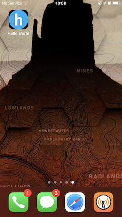
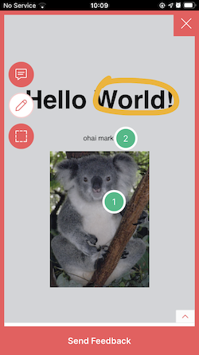
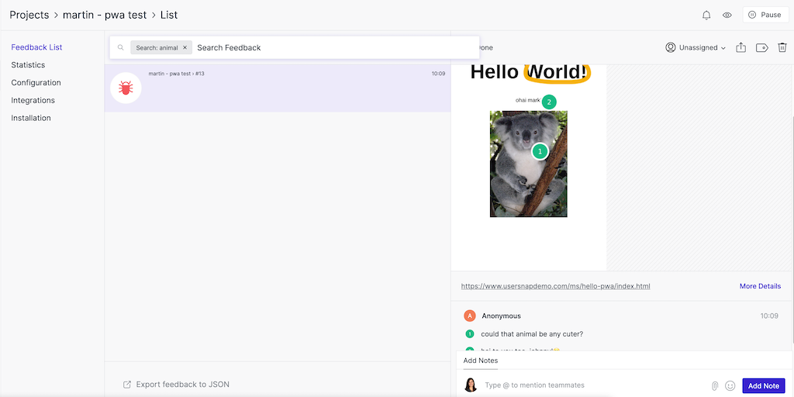

# Hello PWA ins Usersnap

Disclaimer: This is based on [jamesjohnson280/hello-pwa](https://github.com/jamesjohnson280/hello-pwa).

## What is this

This is a very, very simple proof-of-concept to show that [Usersnap](https://usersnap.com) will work with PWAs. Tap the Koala to open a usersnap widget (please add your api-key in `index.html`). T

There are caveats, though:
* The Usersnap widget does not work offline, since it needs to send the feedback data to Usersnap's servers. If your PWA offers offline functionality, sending feedback will only work when you're online.
* Handling reconnects: The naive approach in this demo app will not try to reload the widget if the initial load failed. If you open this PWA without internet connection to initialize the Usersnap widget, it will not open afterwards, even if you regained internet connection. You'll have to work around this by keeping the state of Usersnap's loading somewhere in your app.

With full internet access, Usersnap should be able to collect your feedback and render your screenshots just fine:

## Attributions
* [koala.jpg](https://commons.wikimedia.org/wiki/File:Friendly_Female_Koala.JPG): Quartl, CC BY-SA 3.0 <https://creativecommons.org/licenses/by-sa/3.0>, via Wikimedia Commons
