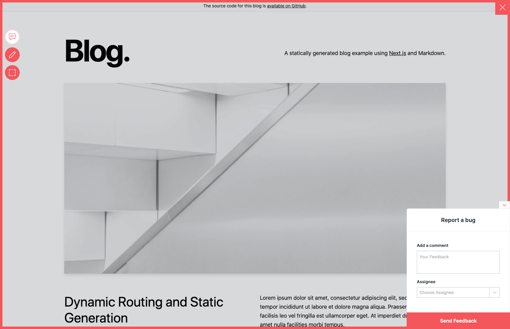

# Add Usersnap to Next.js

This example showcases how to add Usersnap Platform widgets in Next.js. It is based on the Next.js [blog-starter](https://github.com/vercel/next.js/tree/canary/examples/blog-starter) site template.

## Starting up the example

```bash
yarn install
yarn dev
```
The site should be up and running on [http://localhost:3000](http://localhost:3000)! 



## Show me how it's done
The installation of the widget is done in  `pages/_document.js`. 
Make sure to update global api key and project api key values.
 
If it doesn't work, post on [GitHub discussions](https://github.com/usersnap/public/issues).

If you need help on how to use the api, see our [documentation](https://help.usersnap.com/docs/flexible-use-cases-for-global-snippet).

