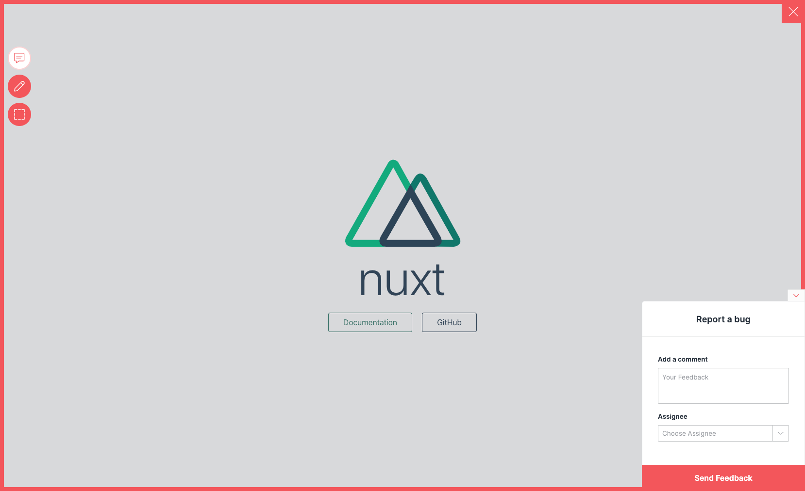

# Add Usersnap to Nuxt.js

This example showcases how to add Usersnap Platform widgets in [Nuxt.js](https://nuxtjs.org). 
The project was created with `create-nux-app`.

## Starting up the example

```bash
# install dependencies
$ yarn install

# serve with hot reload at localhost:3000
$ yarn dev

```

## Show me how it's done
The installation of the widget is done using [`plugins`](https://nuxtjs.org/docs/2.x/directory-structure/plugins)
We create a client plugin file `plugins/usersnap.client.js` and update the plugins entry in the `nuxt.config.js`

Make sure to update global api key and project api key values.

If it doesn't work, post on [GitHub discussions](https://github.com/usersnap/public/issues).

If you need help on how to use the api, see our [documentation](https://help.usersnap.com/docs/flexible-use-cases-for-global-snippet).

