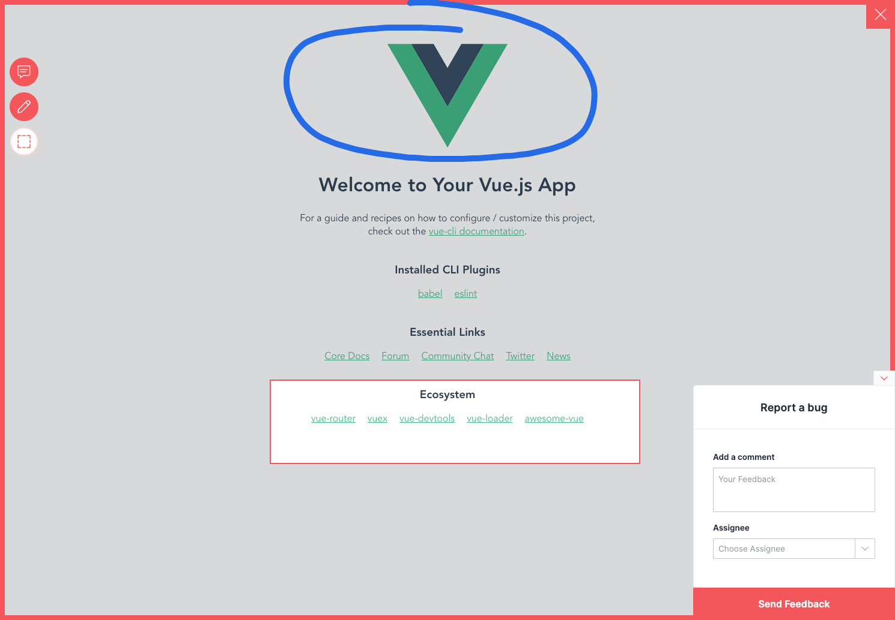

# Add Usersnap to Vue.js App

This example showcases how to add Usersnap Platform widgets in [Vue.js](https://vuejs.org/). 
The project was created with `@vue/cli`.

## Starting up the example

```bash
# install dependencies
$ yarn install

# serve with hot reload at localhost:8080
$ yarn serve

```

## Show me how it's done
See component  `components/Usersnap.vue`.

Make sure to update global api key and project api key values.

If it doesn't work, post on [GitHub discussions](https://github.com/usersnap/public/issues).

If you need help on how to use the api, see our [documentation](https://help.usersnap.com/docs/flexible-use-cases-for-global-snippet).


